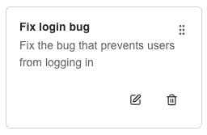
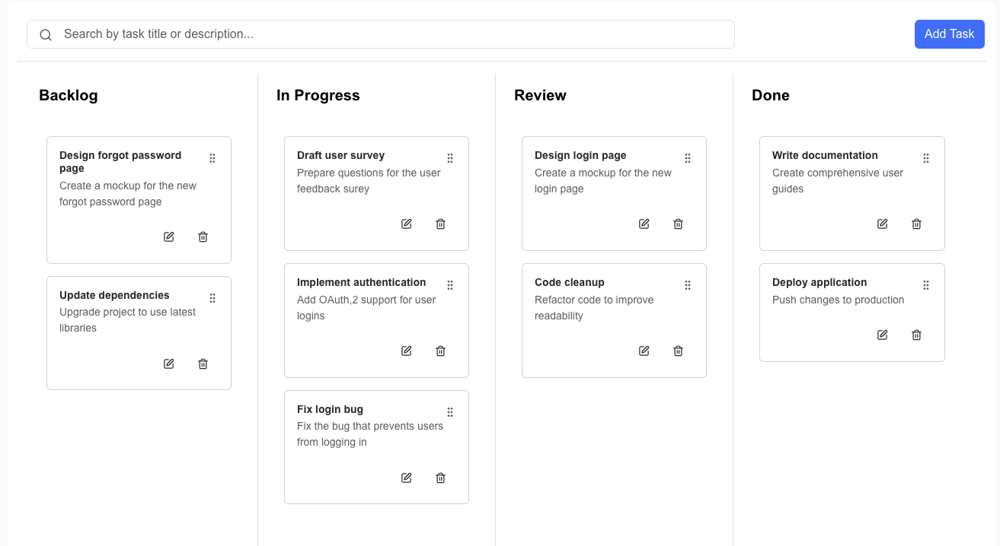
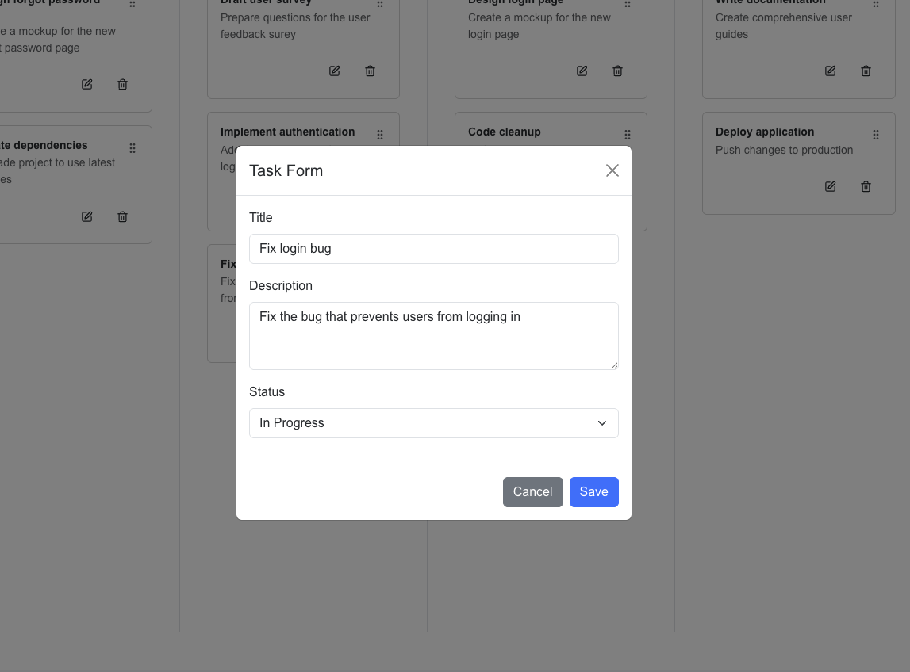

## Kanban To‑Do App

A simple Kanban-style to‑do board built with Next.js App Router, featuring columns, pagination, search, CRUD, and HTML5 drag‑and‑drop (cross‑column moves + intra‑column reordering). Data is served locally via JSON Server.

### Features

- Drag & drop tasks across columns (Backlog, In Progress, Review, Done)
- Create, edit, delete tasks
- Keyword search across title/description
- Pagination per column
- Optimistic, reactive UI using React Query

### Tech Stack (What and Why)

- Next.js (App Router): Modern React framework with file‑system routing and great DX
- React 19: UI layer
- Bootstrap 5: Quick, responsive styling
- React Query: Server‑state management (fetch/mutations, cache, invalidation) instead of Redux for remote data
- Redux Toolkit: UI‑state only (search term, modal open, form fields) to keep presentational components dumb
- Axios: Simple HTTP client
- JSON Server: Schemaless local API for rapid prototyping
- Framer Motion: Smooth enter/exit and reordering animations for task cards

### Project Structure (Key parts)

- `src/app/to-do/page.tsx`: Smart container; wires data, UI state, and presentational components
- `src/app/to-do/components/*`: Dumb components (`TaskCard`, `KanbanColumn`, `TaskFormModal`, `SearchBar`)
- `src/app/to-do/hooks/useTasks.ts`: React Query hooks for CRUD
- `src/store/*`: Redux store for UI state
- `src/types/index.ts`: Shared types

---

## Setup

### 1) Install dependencies

```bash
npm install
```

### 2) Start JSON Server (API)

By default, the app expects the API at `http://localhost:4000`.

```bash
npx json-server --watch db.json --port 4000
```

Optional: configure base URL via env

```bash
export NEXT_PUBLIC_API_BASE_URL=http://localhost:4000
```

### 3) Start the app

```bash
npm run dev
```

Open `http://localhost:3000`.

---

## How Drag & Drop Works

- Start drag from a `TaskCard`; we set the task id and source column on `dataTransfer`.
- Drop on a column; we `PATCH /tasks/:id` with the new `column` and invalidate the cache.

---

## Screenshots





---

## Design Choices

- Smart vs Dumb Components: `page.tsx` manages state and passes props; components render only UI and fire callbacks.
- React Query for server state: better caching/invalidations for CRUD and fewer custom reducers.
- Redux for UI state: clearer intent actions (`setOpen`, `setTitle`, `resetForm`) and predictable updates.
- HTML5 DnD: native, dependency‑free drag behavior suitable for cards/columns.

---

## Scripts

- `npm run dev`: start Next.js dev server
- `npm run build`: production build
- `npm run start`: start production server
- `npx json-server --watch db.json --port 4000`: start local API

---

## API (JSON Server)

- `GET /tasks`: list tasks
- `POST /tasks`: create task
- `PATCH /tasks/:id`: update task (title, description, column, order)
- `DELETE /tasks/:id`: delete task

Note: JSON Server saves any fields you send. There’s no schema validation.

---

## Animations (Framer Motion)

- We use `AnimatePresence` and `motion.div` with `layout` to animate cards when they enter, exit, or reorder.
- Transitions are short and subtle for responsiveness: `duration: 0.18`, `ease: "easeOut"`.
- You can tweak timing/easing in `src/app/to-do/components/KanbanColumn.tsx`.
